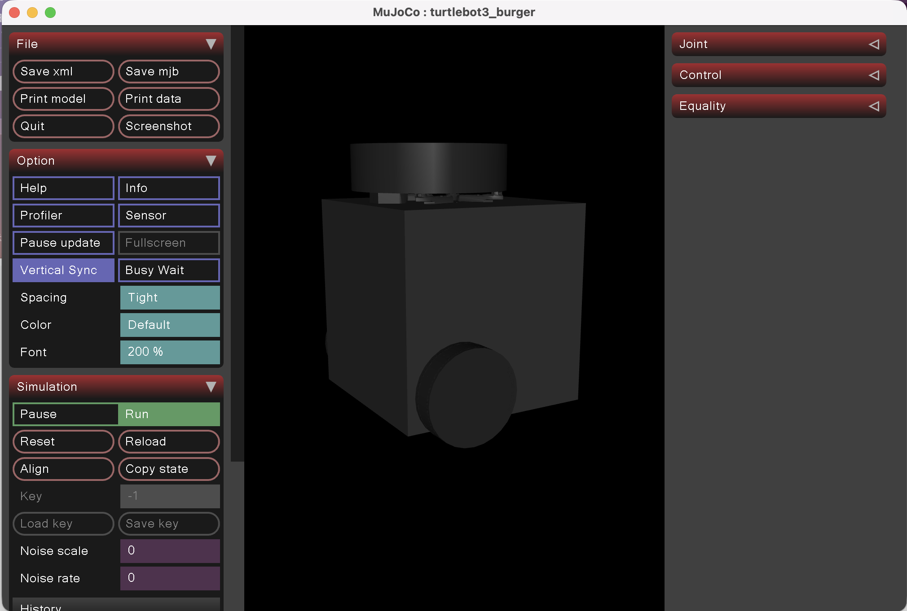
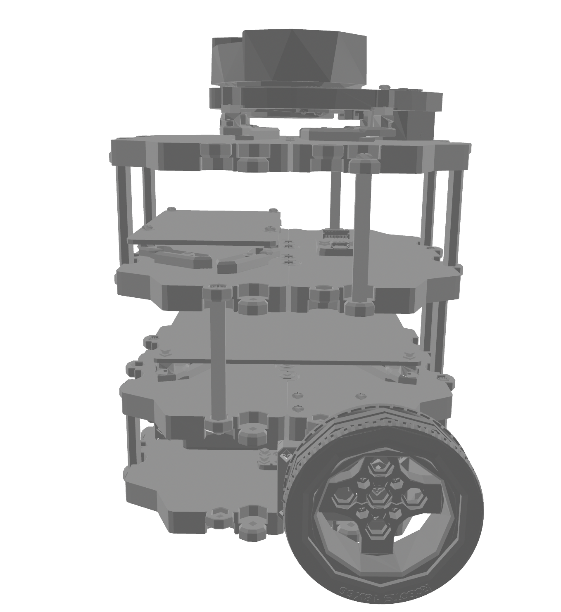
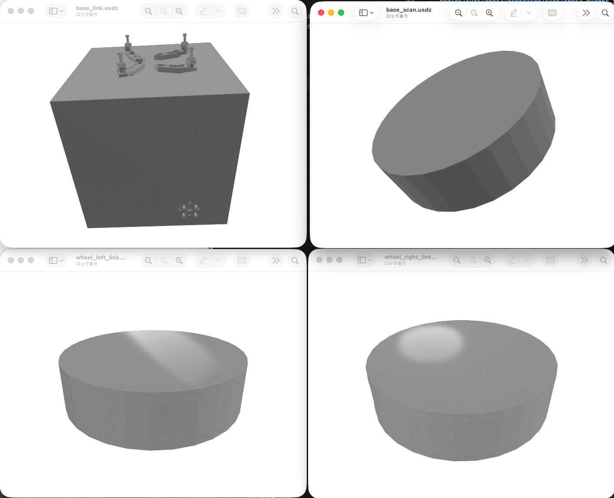

# hakoniwa-mbody-registry

Robot body definitions as molds — convert to URDF, MJCF, and GLB for Hakoniwa simulations.

## What is this?

This repository helps you take an existing robot description and turn it into simulation-ready assets you can actually use.

It is for people who need robot geometry in practical formats:

- robotics researchers who want a reproducible model registry
- simulation developers who need URDF or MuJoCo XML
- game engine or 3D tool users who want GLB assets
- ML / RL engineers who want robot bodies without adopting a full ROS stack

The main value is simple: fetch once, convert once, and keep the generated assets under a predictable local layout.

The ROS-free part matters because it lowers setup cost. You can work with robot body assets using standard Python tools, without installing or maintaining a full ROS environment.

## Registry Pattern

This repository follows the same registry idea as `hakoniwa-pdu-registry`.

- `sources/` stores where the robot description came from
- `tools/` stores how to convert it
- `bodies/{name}/generated/` stores the committed outputs that downstream users can consume directly

Committing generated artifacts is intentional here. It means users can use URDF, MuJoCo XML, and GLB outputs without running the whole conversion pipeline themselves, and upstream robot changes show up as versioned diffs.

## Overview

`hakoniwa-mbody-registry` is a **ROS-independent** registry of robot physical body definitions (mold-bodies) for the [Hakoniwa](https://github.com/hakoniwalab) simulation ecosystem.

It is the physical counterpart to [`hakoniwa-pdu-registry`](https://github.com/hakoniwalab/hakoniwa-pdu-registry):

| Repository | Role |
|---|---|
| `hakoniwa-pdu-registry` | Data communication type definitions (ROS IDL-based) |
| `hakoniwa-mbody-registry` | Robot physical body definitions (xacro-based) |

Each robot body is defined as a **mold** (mbody) — a xacro-based source definition that can be cast into multiple simulation formats.

## Toolchain

```text
fetch.py
  -> upstream robot description
  -> local source snapshot under bodies/{name}/source/

xacro2urdf.py
  -> xacro / xacro-enabled URDF
  -> bodies/{name}/generated/{model}.urdf

urdf2mjcf.py
  -> plain URDF
  -> bodies/{name}/generated/{model}.xml

urdf2glb.py
  -> plain URDF
  -> bodies/{name}/generated/{model}.glb

mjcf2glb.py
  -> canonical MuJoCo XML
  -> bodies/{name}/generated/parts/*.glb
```

All tools are bundled in `tools/` and are intended to work without a ROS installation.

## Dependencies

The tools require these Python packages:

```bash
python3 -m pip install -r requirements.txt
```

## Repository Structure

```
hakoniwa-mbody-registry/
├── requirements.txt      # Python dependencies for the toolchain
├── tools/
│   ├── fetch.py          # Sparse fetch from upstream Git repositories
│   ├── xacro2urdf.py     # ROS-free xacro / xacro-enabled URDF -> plain URDF
│   ├── urdf2mjcf.py      # URDF -> canonical MuJoCo XML
│   ├── urdf2glb.py       # URDF -> single GLB scene
│   ├── mjcf2glb.py       # MuJoCo XML -> split GLB assets
│   └── forge.sh          # Convenience pipeline wrapper
├── bodies/               # Registry-managed source snapshots and generated artifacts
│   └── turtlebot3/
│       ├── source/       # Fetched upstream files, not committed
│       └── generated/    # Converted artifacts, committed
├── docs/
│   └── images/           # Placeholder location for README screenshots
├── sources/              # Declarative fetch definitions per robot
│   └── tb3.yaml          # TurtleBot3
└── README.md
```

### `sources/` — Fetch Definitions

Each YAML file declares where to fetch robot source files from and which paths to retrieve:

```yaml
name: turtlebot3
repo: https://github.com/ROBOTIS-GIT/turtlebot3
branch: humble
files:
  - turtlebot3_description/
```

Running `tools/fetch.py` reads these files and performs a sparse checkout of only the listed paths into `bodies/{name}/source/`, preserving the upstream relative paths.

### `bodies/` layout

- `bodies/{name}/source/`
  Fetched from upstream. This is a local snapshot used as conversion input and is not committed.
- `bodies/{name}/generated/`
  Generated artifacts. These are committed as registry outputs for downstream users.

## Tools

### `tools/fetch.py`

Fetch only the robot files you need from an upstream Git repository.

Fetches robot description assets from an upstream Git repository using sparse checkout.

- Input: `sources/*.yaml`
- Output: `bodies/{name}/source/...`

### `tools/xacro2urdf.py`

Turn a xacro-based robot description into a plain URDF file.

Expands xacro into plain URDF without ROS.

- Input: `.xacro` or xacro-enabled `.urdf`
- Output: `bodies/{name}/generated/{stem}.urdf` by default when the input is under `bodies/{name}/`
- Supports `--arg NAME=VALUE`
- Detects unsupported ROS-style `$(find ...)` expressions and fails early with file and line information

Example:

```bash
python3 tools/xacro2urdf.py \
  bodies/turtlebot3/source/turtlebot3_description/urdf/turtlebot3_burger.urdf
```

### `tools/urdf2mjcf.py`

Convert a plain URDF into canonical MuJoCo XML using MuJoCo's official compiler.

Uses the official MuJoCo Python bindings to load URDF and save canonical MuJoCo XML.

- Input: plain URDF
- Output: `bodies/{name}/generated/{stem}.xml` by default when the input is under `bodies/{name}/`
- Rewrites `package://...` mesh references before invoking MuJoCo
- If the package root cannot be inferred from the input path, pass `--package-root PACKAGE=PATH`

Example:

```bash
python3 tools/urdf2mjcf.py \
  bodies/turtlebot3/generated/turtlebot3_burger.urdf
```

### `tools/urdf2glb.py`

Export the robot's visual geometry as one GLB scene.

Loads URDF visual geometry into a `trimesh.Scene` and exports a single GLB scene.

- Input: plain URDF
- Output: `bodies/{name}/generated/{stem}.glb` by default when the input is under `bodies/{name}/`
- Supports mesh, box, cylinder, and sphere visuals
- Supports `package://...` mesh references

Example:

```bash
python3 tools/urdf2glb.py \
  bodies/turtlebot3/generated/turtlebot3_burger.urdf
```

### `tools/mjcf2glb.py`

Split a MuJoCo XML model into smaller GLB assets that match its body or geom structure.

Splits a canonical MuJoCo XML model into multiple GLB files.

- Input: canonical MuJoCo XML produced by `urdf2mjcf.py`
- Output: `bodies/{name}/generated/parts/*.glb` by default when the input is under `bodies/{name}/`
- Default: `--split-by body`
- Alternative: `--split-by geom`

Example:

```bash
python3 tools/mjcf2glb.py \
  bodies/turtlebot3/generated/turtlebot3_burger.xml
```

## Quick Start

```bash
# 1. Install dependencies
python3 -m pip install -r requirements.txt

# 2. Fetch robot source files
python3 tools/fetch.py sources/tb3.yaml

TB3_URDF=bodies/turtlebot3/source/turtlebot3_description/urdf/turtlebot3_burger.urdf

# 3. Expand xacro / xacro-enabled URDF
python3 tools/xacro2urdf.py $TB3_URDF

# 4. Convert URDF to canonical MuJoCo XML
python3 tools/urdf2mjcf.py bodies/turtlebot3/generated/turtlebot3_burger.urdf

# 5. Convert URDF to a single GLB scene
python3 tools/urdf2glb.py bodies/turtlebot3/generated/turtlebot3_burger.urdf

# 6. Split MuJoCo XML into per-body GLB assets
python3 tools/mjcf2glb.py bodies/turtlebot3/generated/turtlebot3_burger.xml
```

Typical outputs for TurtleBot3 Burger are created under `bodies/turtlebot3/generated/`:

- `turtlebot3_burger.urdf`
- `turtlebot3_burger.xml`
- `turtlebot3_burger.glb`
- `parts/*.glb`

## Walkthrough: TurtleBot3 Burger

This is the simplest end-to-end example in the repository. It starts from the upstream TurtleBot3 description and produces:

- a plain URDF
- a canonical MuJoCo XML file
- a single GLB scene
- split GLB assets based on the MuJoCo body structure

```bash
# Step 1: Fetch TB3 description from upstream
python3 tools/fetch.py sources/tb3.yaml

# Step 2: Expand xacro to plain URDF
python3 tools/xacro2urdf.py \
  bodies/turtlebot3/source/turtlebot3_description/urdf/turtlebot3_burger.urdf

# Step 3: Convert URDF to MuJoCo XML
python3 tools/urdf2mjcf.py \
  bodies/turtlebot3/generated/turtlebot3_burger.urdf

# Step 4: Convert URDF to GLB (single scene)
python3 tools/urdf2glb.py \
  bodies/turtlebot3/generated/turtlebot3_burger.urdf

# Step 5: Split MuJoCo XML into per-body GLB assets
python3 tools/mjcf2glb.py \
  bodies/turtlebot3/generated/turtlebot3_burger.xml
```

Expected output files:

- `bodies/turtlebot3/generated/turtlebot3_burger.urdf`
- `bodies/turtlebot3/generated/turtlebot3_burger.xml`
- `bodies/turtlebot3/generated/turtlebot3_burger.glb`
- `bodies/turtlebot3/generated/parts/*.glb`

## Gallery

### TurtleBot3 Burger — MJCF (MuJoCo Viewer)


### TurtleBot3 Burger — GLB (3D Scene)


### TurtleBot3 Burger — Split Parts (GLB)


## Registered Robots

| Name | Source | Formats |
|---|---|---|
| TurtleBot3 (TB3) | [ROBOTIS-GIT/turtlebot3](https://github.com/ROBOTIS-GIT/turtlebot3) | URDF, MJCF, GLB |

## Status & TODO

### Done
- [x] Repository created
- [x] Directory structure defined
- [x] `sources/tb3.yaml` — TB3 fetch definition
- [x] `tools/fetch.py` — sparse fetch from upstream repos
- [x] `tools/xacro2urdf.py` — ROS-free xacro → URDF conversion
- [x] `tools/urdf2mjcf.py` — URDF → MJCF conversion via MuJoCo
- [x] `tools/urdf2glb.py` — URDF → GLB conversion
- [x] `tools/mjcf2glb.py` — MJCF → split GLB conversion
- [x] TB3 の変換検証（MJCF, GLB）

### In Progress
- [ ] `tools/forge.sh` or `tools/forge.py` — full pipeline runner

### Planned
- [ ] CI/CD: push 時に自動変換・成果物アップロード
- [ ] 追加ロボットの登録

## License

MIT
